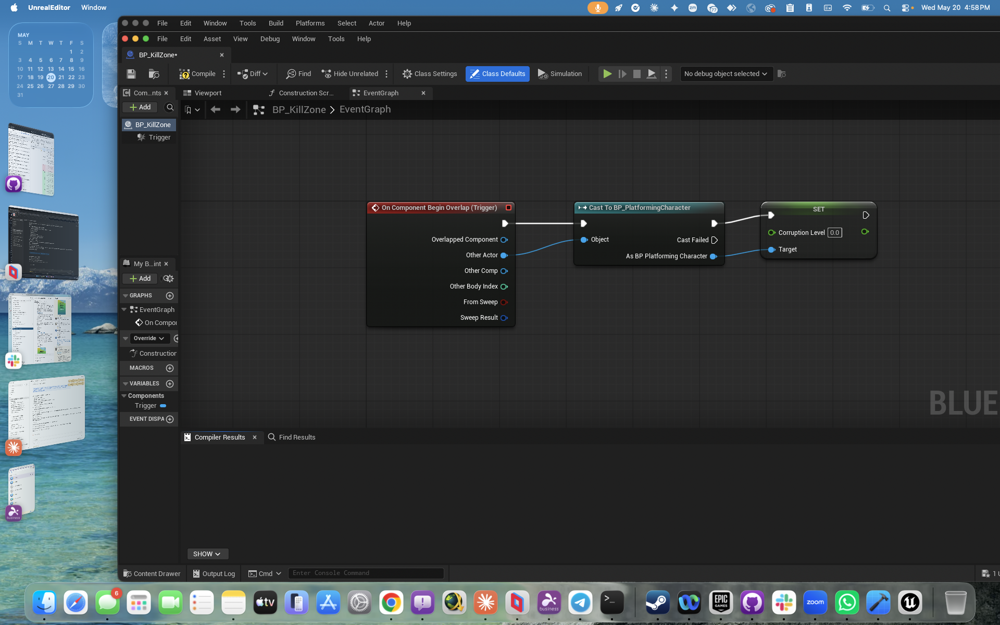

# BP_KillZone — Cleanse Zone



## What it does

When the wizard player overlaps this trigger volume, the player's `CorruptionLevel`
is reset to `0.0`. The zone is a "safe room" or "purification altar" in the arena.

## Graph (3 nodes, horizontal flow)

| Node | Role |
|---|---|
| `On Component Begin Overlap (Trigger)` | Fires when any actor enters the BoxTrigger volume |
| `Cast To BP_PlatformingCharacter` | Narrows the OtherActor to the wizard — non-wizard actors hit `Cast Failed` (no-op) |
| `Set CorruptionLevel = 0.0` | Writes the variable on the cast result; uses `variable_class` so the setter targets the player BP, not self |

## Why the cast matters

The trigger fires for any pawn or actor that overlaps. Casting first means stray
projectiles, enemies, or test cubes can't accidentally clear corruption — only
the wizard's overlap matters.

## Key ECABridge gotcha

The `SetCorruptionLevel` node was created via `batch_edit_blueprint_nodes` with
the `variable_class` parameter (added to ECABridge today as commit `1c395fa`):

```python
{
  "temp_id": "set_corrupt",
  "type": "variable_set",
  "variable_name": "CorruptionLevel",
  "variable_class": "/Game/Variant_Platforming/Blueprints/BP_PlatformingCharacter.BP_PlatformingCharacter_C"
}
```

Without `variable_class`, the setter would fall back to `SetSelfMember` and
attempt to write `CorruptionLevel` on the killzone itself — silently failing
because the killzone has no such variable.

## Tuning knobs

- `BoxTrigger.BoxExtent` — size of the cleanse zone (default 50×50×50)
- `Set CorruptionLevel.CorruptionLevel` default = `0.0` (could be 0.5 for partial cleanse, etc.)

## Test plan

1. Player walks into volume → corruption goes to 0 (verify via PrintString HUD).
2. Enemy walks into volume → no error, no effect (cast fails silently).
3. Cleanse repeats if player walks out and back in.

## Collision profile

`BoxTrigger.CollisionProfileName = "Trigger"` (QueryOnly) — see
`docs/engine-reference/unreal/ecabridge-patterns.md` for why `OverlapAllDynamic`
doesn't work on pawn overlap.
