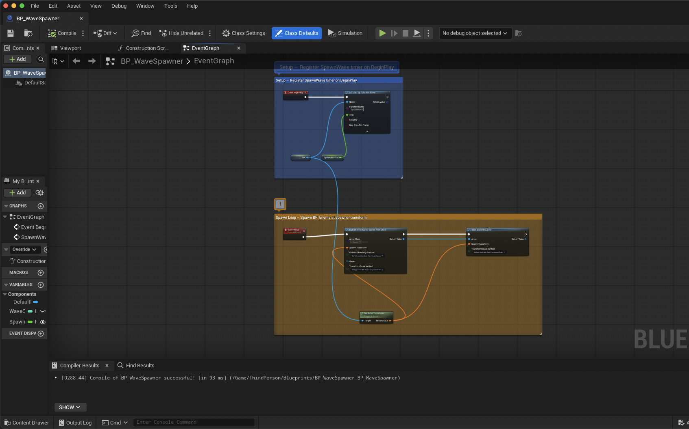

# BP_WaveSpawner — Enemy Wave Generator



*Original layout (auto_layout without manual positioning, no labels): see [02-bp-wavespawner.png](02-bp-wavespawner.png)*

## What it does

Acts as a fixed point in the arena that spawns `BP_Enemy` zombies at a regular
interval. Three instances are placed at East/West/North (±1500 units from the
PlayerStart). Together they create constant pressure on the wizard.

## Two execution chains (labelled inline)

**Blue: Setup — Register SpawnWave timer on BeginPlay**

```
BeginPlay → SetTimerByFunctionName(self, "SpawnWave", SpawnInterval, looping=true)
```

Registers a recurring timer that calls the `SpawnWave` custom event every
`SpawnInterval` seconds (default 3.0s, instance-editable). `Looping=true` is
the critical flag — without it, the spawner fires once and goes silent.

**Orange: Spawn Loop — Spawn BP_Enemy at spawner transform**

```
SpawnWave → BeginDeferredActorSpawnFromClass(BP_Enemy, GetActorTransform)
         → FinishSpawningActor(spawned_actor, same_transform)
```

The deferred-spawn pattern is how Blueprint's "Spawn Actor From Class" K2 node
desugars under the hood:

1. `BeginDeferredActorSpawnFromClass` creates the actor but does NOT run BeginPlay yet
2. (Optional middle step: set exposed properties on the deferred actor)
3. `FinishSpawningActor` runs BeginPlay and finalizes the spawn

For the prototype we don't set any exposed properties, so the begin/finish pair
behaves identically to the simpler K2 spawn node — but ECABridge can't add the
K2 node directly, so we wire the static GameplayStatics functions instead.

## How the labels were added (ECABridge new commands)

The blue and orange comment regions came from the new
[`add_blueprint_comment_node`](../../../ue/ThirdPersonClass/Plugins/ECABridge/docs/new-layout-commands-2026-05-20.md)
MCP command shipped to ECABridge today on
[feature/blueprint-layout-and-comment-2026-05-20](https://github.com/ibrews/ECABridge/tree/feature/blueprint-layout-and-comment-2026-05-20):

```jsonc
// Setup region (blue)
add_blueprint_comment_node({
  "blueprint_path": "/Game/ThirdPerson/Blueprints/BP_WaveSpawner",
  "comment": "Setup — Register SpawnWave timer on BeginPlay",
  "wrap_node_ids": ["<BeginPlay>", "<SetTimer>", "<Self>", "<GetSpawnInterval>"],
  "color": "#3B82F6",
  "margin": 60
})

// Spawn Loop region (orange)
add_blueprint_comment_node({
  "blueprint_path": "/Game/ThirdPerson/Blueprints/BP_WaveSpawner",
  "comment": "Spawn Loop — Spawn BP_Enemy at spawner transform",
  "wrap_node_ids": ["<SpawnWave>", "<BeginDeferred>", "<FinishSpawn>", "<GetActorTransform>"],
  "color": "#F59E0B",
  "margin": 60
})
```

The `wrap_node_ids` parameter auto-sizes the comment to enclose the listed nodes
with the specified margin. The new
[`set_blueprint_node_position`](../../../ue/ThirdPersonClass/Plugins/ECABridge/docs/new-layout-commands-2026-05-20.md)
command was used first to lay out the 8 underlying nodes in two clean rows
(Setup row at y=0, Spawn Loop row at y=900, helpers offset to y=420 and y=1450).

## Variables

| Variable | Type | Default | Editable | Purpose |
|---|---|---|---|---|
| `SpawnInterval` | Float | 3.0 | per-instance | Seconds between spawns |
| `WaveCount` | Integer | 0 | per-instance | (Reserved for future escalation logic) |

## Collision handling

`CollisionHandlingOverride = Try To Adjust Location, But Always Spawn` — UE will
nudge the spawn position slightly if it would overlap, but will ALWAYS produce
an enemy. Prevents "spawn failed because something is in the way" silent drops.

## Placement

3 instances in `Lvl_ThirdPerson`:
- `WaveSpawner_East`  at `( 1500,    0, 200)`
- `WaveSpawner_West`  at `(-1500,    0, 200)`
- `WaveSpawner_North` at `(    0, 1500, 200)`

The PlayerStart sits at `(0, 0, 302)` so enemies converge on the player from
three directions.

## ECABridge gotchas worth slide-time

1. **`create_blueprint` auto-adds 3 disabled event stubs** — Event BeginPlay,
   Event ActorBeginOverlap, Event Tick — tagged "This node is disabled and will
   not be called." Delete them after creating your real entry points.

2. **`SpawnActorFromClass` isn't a function name** — the BP-native "Spawn Actor
   From Class" is a K2 special node (`K2Node_SpawnActorFromClass`). ECABridge
   can't add K2 special nodes; use the static `GameplayStatics::BeginDeferred…`
   + `FinishSpawningActor` pair instead.

3. **`GetActorTransform` is exposed as `GetTransform`** — the C++ name is
   `GetActorTransform()` but the BP-callable version is just `GetTransform`
   on `Actor`. `add_blueprint_function_node` accepts the BP-callable name.

4. **`add_blueprint_comment_node` requires `wrap_node_ids` for clean labelling** —
   passing fixed `x/y/width/height` works but is fragile when the wrapped nodes
   later move. `wrap_node_ids` recomputes the bounding box on every call.

5. **`set_blueprint_node_position` is the safe alternative to Python NodePosX/Y
   reflection** — directly poking `NodePosX` via `unreal.execute_python` crashed
   UE 5.7 twice during this session's authoring. The MCP command routes through
   `Modify()` + `MarkBlueprintAsStructurallyModified` so the editor refreshes.
