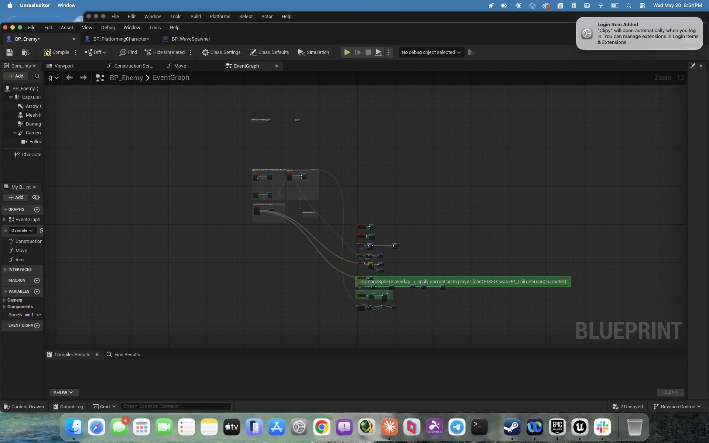

# BP_Enemy — DamageSphere Cast Bug Fix

**Date:** 2026-05-20 (evening session)
**Blueprint:** `/Game/ThirdPerson/Blueprints/BP_Enemy`

## What was wrong

The DamageSphere overlap handler — triggered when an enemy physically touches the
player — was casting `OtherActor` to `BP_ThirdPersonCharacter`. But the
`DefaultPawnClass` is `BP_PlatformingCharacter`. The cast **always failed
silently**, meaning enemies could never corrupt the player through contact.

The `Event AnyDamage` path (enemy receives damage from fireball) was already
correctly casting to `BP_PlatformingCharacter` — only the touch-corruption path
was broken.

## What was fixed

Deleted `Cast To BP_ThirdPersonCharacter` (node `996AEB982A4F8C06E4A63B987FBBC4B3`).
Replaced with `Cast To BP_PlatformingCharacter` at the same graph position (294, 1870).
Reconnected all 4 pins:

| From | Pin | To | Pin |
|------|-----|----|-----|
| Event ActorBeginOverlap | then | Cast To BP_PlatformingCharacter | execute |
| Event ActorBeginOverlap | OtherActor | Cast To BP_PlatformingCharacter | Object |
| Cast To BP_PlatformingCharacter | then | Apply Damage | execute |
| Cast To BP_PlatformingCharacter | AsBP Platforming Character | Apply Damage | DamagedActor |

## Flow (after fix)

```
Event ActorBeginOverlap (DamageSphere)
  → Cast To BP_PlatformingCharacter   ← FIXED (was BP_ThirdPersonCharacter)
    → [cast succeeded]
      → Apply Damage (Damage=0.25, DamagedActor=player)
```

## Slide screenshot


