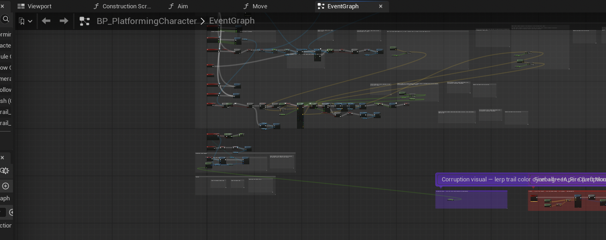

# BP_PlatformingCharacter — Corruption Trail Color

**Date:** 2026-05-20 (evening session)
**Blueprint:** `/Game/Variant_Platforming/Blueprints/BP_PlatformingCharacter`

## What this does

On every Tick, the player's two Niagara trail components (`Trail_L`, `Trail_R`)
have their `Color` parameter driven by `CorruptionLevel` (0.0 → 1.0):

- **0.0 (clean):** cyan `(R=0, G=1, B=1)`
- **1.0 (fully corrupted):** necrotic green `(R=0.1, G=0.6, B=0)`
- Intermediate values lerp smoothly between them

## Implementation

Uses `SetColorParameter("Color")` on `FXSystemComponent` (the base class that
`NiagaraComponent` inherits from) — consistent with the existing jump-trail color
system already in this Blueprint.

### Nodes added (all at x≈5000–6450, y≈5000)

| Node | Details |
|------|---------|
| Event Tick | Drives the update every frame |
| Get CorruptionLevel | Reads current corruption (0.0–1.0) as Alpha |
| Lerp (LinearColor) | A=(0,1,1,1) cyan, B=(0.1,0.6,0,1) green |
| Get Trail_L | NiagaraComponent reference |
| Set Color Parameter | ParameterName="Color", Target=Trail_L |
| Get Trail_R | NiagaraComponent reference |
| Set Color Parameter | ParameterName="Color", Target=Trail_R |

Comment label: purple `#7C3AED` wrapping all 7 nodes.

## Flow

```
Event Tick
  → Set Color Parameter (Trail_L, "Color", Lerp(cyan, green, CorruptionLevel))
    → Set Color Parameter (Trail_R, "Color", same lerp result)
```

## Design notes

- Tick-driven rather than event-driven: `CorruptionLevel` can change from
  multiple sources (enemy touch, cleanse zone, future poison zones). Tick is
  simpler than hooking every setter.
- `SetColorParameter` is the FXSystemComponent base-class API — works for both
  Niagara and Cascade. Matches the existing jump trail color call style.
- Colors chosen to match the Spellrot corruption palette: cyan = purified magic,
  necrotic green = corruption spread.

## Slide screenshot


